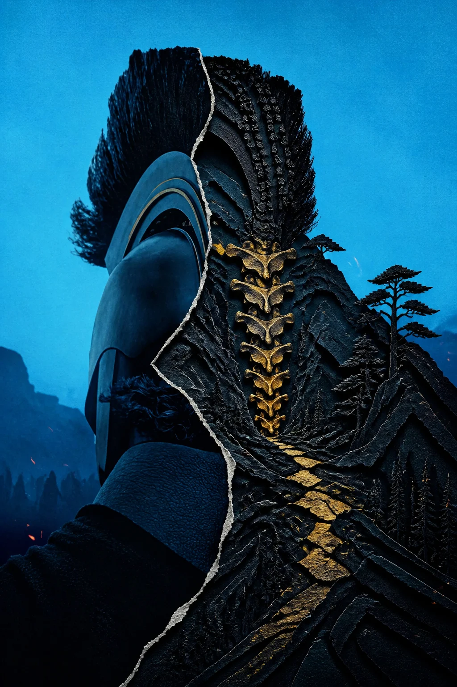
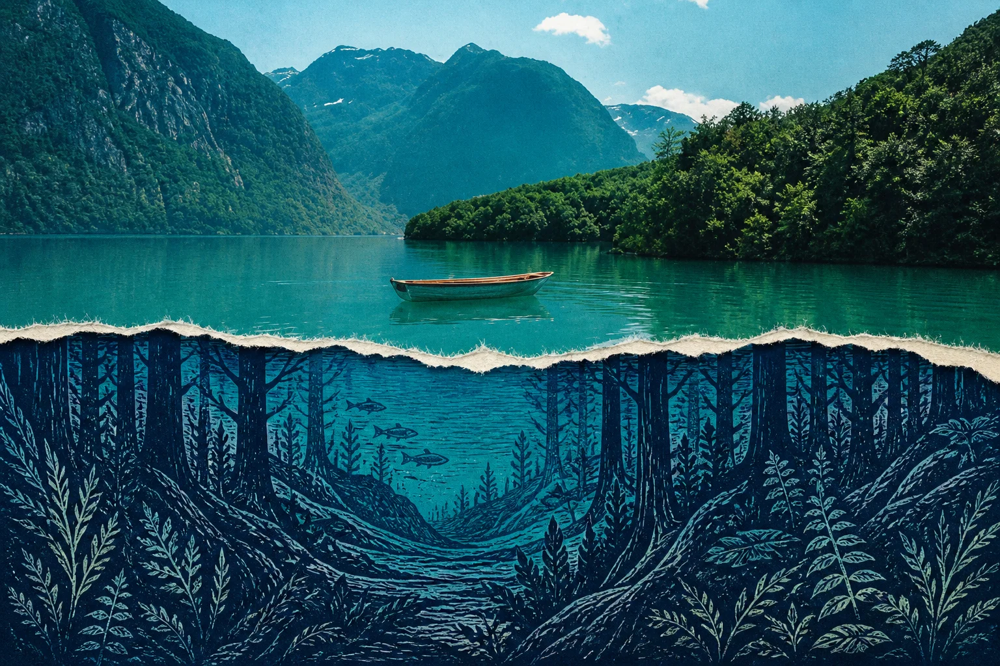
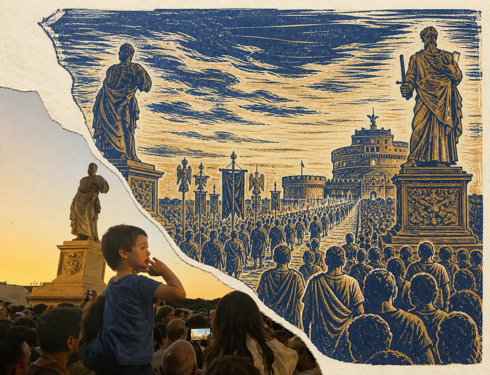
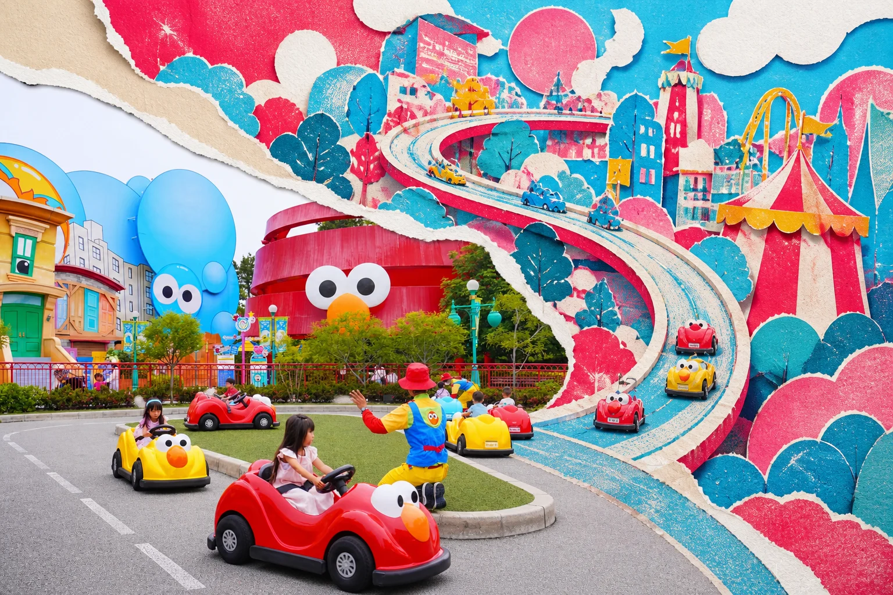
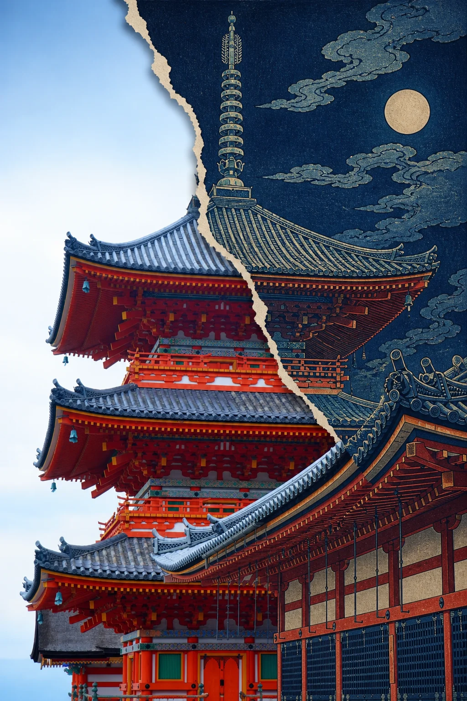
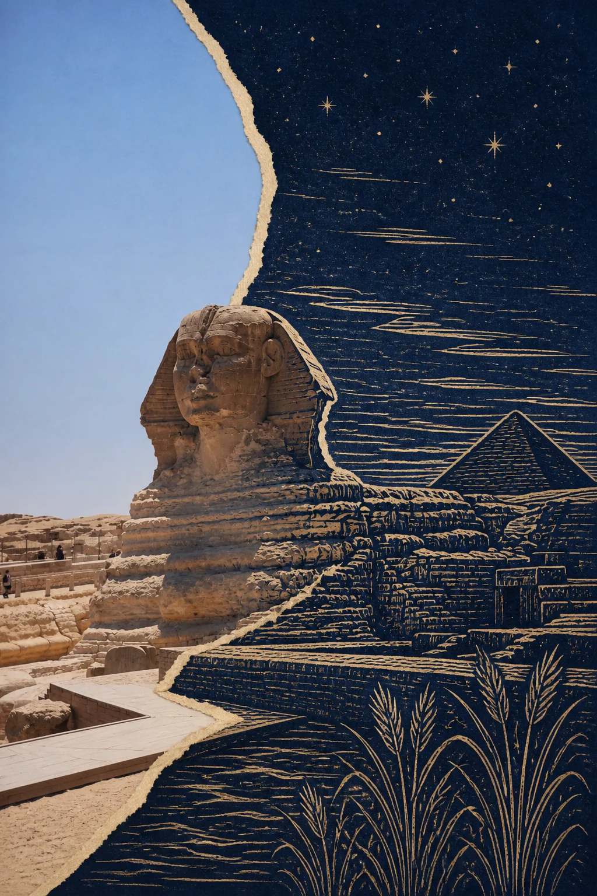

<div align="center">

# PHOTO SECOND WORLD

Open a photograph and let the same scene continue in another world.

**Made by Trae1ounG**

[中文](README.md) · [Gallery](#gallery) · [Install](#install)

</div>



> Another world is still hidden beneath the photograph.

`photo-second-world` is an image-making Skill for Codex. It keeps one truthful photographic anchor, opens a substantial region along the source geometry, and rebuilds that region in one coherent paper-native visual language. The two realities share the same subject contours and spatial movement while changing material, time, atmosphere, or scale.

## How it works

```text
read the photograph → preserve the anchor → find the structural threshold → open the second world → resolve one complete artwork
```

- Preserve the source relationship that makes the scene unmistakable.
- Let the threshold follow a real contour, horizon, body, path, ridge, shadow, or perspective.
- Choose one material language rather than stacking decorative effects.
- Continue the source geometry across the boundary while changing visual reality.
- Make the reconstruction large enough to read immediately at feed size.

## Gallery

Only authorized generated results are included. Original user photographs are not published.

| Beneath the lake | Inside history |
| :---: | :---: |
|  |  |

| Printed amusement | Temple by moonlight |
| :---: | :---: |
|  |  |

| Armor ridge | Sphinx at night |
| :---: | :---: |
|  |  |

## Install

```bash
git clone https://github.com/Trae1ounG/photo-second-world-skill.git
mkdir -p ~/.codex/skills
cp -R photo-second-world-skill/skills/photo-second-world ~/.codex/skills/
```

Restart Codex if the Skill does not appear immediately.

## Use

Upload a photograph and invoke:

```text
Use $photo-second-world to create an artwork from this photograph.
```

## Privacy

Use supplied images only for the current generation task. Do not save, share, or publish original user images unless the user explicitly authorizes it. The gallery contains generated results that were explicitly approved for publication.

<div align="center">

**Trae1ounG made · Another world is still hidden beneath the photograph.**

</div>
